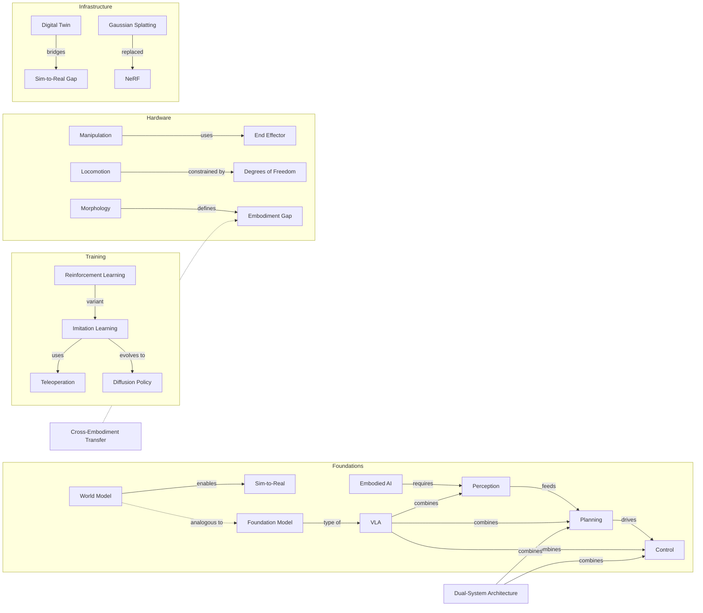

# AI Learning Engine v4

**Turn any AI assistant into a structured tutor with spaced repetition, mastery gates, and proof-of-learning.**


---

## Why I Built This

I needed to learn an entirely new field from scratch — robotics, world models, embodied intelligence. Not casually. Deeply enough to hold real conversations with experts.

YouTube and articles didn't work. Passive consumption, no feedback loop, no way to know if I actually understood anything. So I built a system that forces active recall, blocks advancement until I prove understanding, and tracks every concept with spaced repetition.

3 sessions in: quiz scores climbing, categorization accuracy 51.5% → 86%, founder-level explanations scoring 9/10. The system works. Fork it and learn anything.

v4 adds persona-aware teaching — the engine adapts its vocabulary, analogies, and difficulty to who you are, and threads your learning goal through every question.

---

> **Building & Learning in Public**
> Currently learning: Spatial AI | Day 5/50 | 38 terms tracked | 5 sessions complete
>
> [Live Analytics Dashboard](https://hanselhansel.github.io/ai-learning-engine/portfolio/analytics-dashboard.html)

---

## Session Summary Card

```
╔══════════════════════════════════════════════╗
║          LEARNING SESSION RECEIPT            ║
╠══════════════════════════════════════════════╣
║  Session:    #5 (Day 4)                      ║
║  Mode:       Standard                        ║
║  Duration:   ~90 min                         ║
║  Date:       2026-03-20                      ║
║  Streak:     1 day                           ║
╠══════════════════════════════════════════════╣
║  SM-2 Quiz:  7.2/10 (FIRST PASS ✓)          ║
║  Strongest:  World Model (9/10)             ║
║  Strongest:  Cross-Embodiment (9/10)        ║
║  Investor Thesis: 3 companies analyzed      ║
║  Community:  World Labs hackathon observed  ║
╠══════════════════════════════════════════════╣
║  Terms Known:    0 / 38                      ║
║  Terms Learning: 38                          ║
║  Overall:        8% complete (4/50 days)     ║
╠══════════════════════════════════════════════╣
║  ★ AMI Labs / JEPA explanation: 8/10         ║
║  🔧 Focus: Diffusion Policy (3/10)          ║
║  Next: Day 5 — Deeper into the Stack        ║
╚══════════════════════════════════════════════╝
```

---

## Analytics Dashboard

Track your learning progress with a live Chart.js dashboard:

**[View Live Dashboard](https://hanselhansel.github.io/ai-learning-engine/portfolio/analytics-dashboard.html)**

- Mastery curve (known vs. learning terms over time)
- Velocity trend (learning speed across sessions)
- Confidence calibration (over/under-confident detection)
- Pre-test to post-test delta

Deploy your own via GitHub Pages (Settings → Pages → main branch).

---

## Concept Map



---

## How It Works

```bash
git clone https://github.com/hanselhansel/ai-learning-engine.git my-learning-project
cd my-learning-project
```

1. **Clone the repo** (above)
2. **Generate a curriculum**: Run `/generate-curriculum` and answer 8 questions — or copy an example from `examples/` and customize
3. **Configure**: Copy `CURRICULUM-CONFIG-TEMPLATE.md` to `CURRICULUM-CONFIG.md` and fill in your learner bridges and preferences
4. **Install skills**: Follow your platform's setup guide (see [Platform Setup](#platform-setup))
5. **Start learning**: Type `/learn` — type `/learn-end` to save and exit early

See `SETUP-GUIDE.md` for the full walkthrough.

---

## Features (42)

### Core Engine (11 — from v2)

1. **Pre-testing** — test before teaching for stronger memory traces
2. **SM-2 spaced repetition** — algorithmic review scheduling with ease factors
3. **Socratic method** — ask-then-reveal, never lecture-first
4. **Interleaved practice** — cross-session concept mixing
5. **Mastery-based progression** — gates with escape valve (never blocks indefinitely)
6. **Portfolio-grade exercises** — every drill produces a real artifact
7. **Confidence calibration** — metacognition tracking (over/under-confident detection)
8. **7-concept cap** — depth over breadth per session
9. **Weekly synthesis** — integration challenge every 5th session
10. **Config-driven** — CURRICULUM-CONFIG.md separates content from engine
11. **Learning velocity dashboard** — trend tracking across sessions

### Adaptive Features (13 — new in v3)

12. **Flex sessions** — 5 modes: Micro (5m), Quick (15m), Standard (60m), Deep (120m), Synthesis
13. **Content compression** — skip/compress mastered concepts
14. **Difficulty scaling** — harder when ahead, easier when struggling
15. **Velocity-based pacing** — adjust session based on learning speed
16. **Spaced exercise repetition** — SM-2 for drills, not just terms
17. **Teach-back mode** — explain to a colleague for 90% retention
18. **Concept linking** — relationship graph between concepts
19. **Mid-lesson retrieval** — quick recall prompts during Socratic lessons
20. **Growth reflection** — revisit Day 1 artifacts to see progress
21. **Auto-generated sessions** — web research for fresh content
22. **Warm-start migration** — preserve progress when upgrading
23. **Curriculum generator** — guided "what do you want to learn?" skill
24. **Session variety** — debate, case study, deep-dive, reverse quiz

### Engagement Features (8 — new in v3)

25. **Analytics Dashboard** — HTML with Chart.js (mastery curve, velocity, confidence)
26. **Session Summary Card** — workout-receipt per session
27. **Peer Teaching Simulation** — skeptical colleague with follow-up questions
28. **Concept of the Day** — surprise retrieval at session open
29. **Curriculum Gallery** — pre-built examples (finance, PM, ML, spatial AI)
30. **Micro-Review Mode** — 5-min coffee-break review
31. **Mermaid Concept Map** — auto-generated visual knowledge web
32. **Learning Streak & Milestones** — don't-break-the-chain motivation

### Persona & Adaptation Features (10 — new in v4)

33. **Learner Personas** — 5 teaching styles: Elementary, Teen, Adult Beginner, Professional, Expert
34. **Objective Threading** — 6 goal templates thread your WHY through every question
35. **Adaptive Refinement** — auto-detects if teaching level needs adjustment
36. **First-Run Detection** — auto-redirects new users to curriculum setup
37. **Interactive Placement Test** — 3-question diagnostic auto-assigns your persona
38. **Session Tone Preview** — see how the engine will teach you before starting
39. **Multi-Objective Blending** — weighted goal mixing (60% career + 40% investing)
40. **Portfolio Auto-Generator** — objective-aware portfolio showcase page
41. **Cross-Curriculum Transfer Credits** — SM-2 mastery carries across curricula via canonical IDs
42. **Weekly Learning Digest** — weekly summary with upcoming topics and spicy questions

---

## Flex Session Modes

| Mode | Time | Best For |
|------|------|----------|
| **Micro** | 5 min | Coffee break, quick SM-2 review |
| **Quick** | 15-20 min | Morning warmup, light practice |
| **Standard** | 50-65 min | Full learning cycle (default) |
| **Deep Dive** | 90-120+ min | Teach-back, concept linking, deep exploration |
| **Synthesis** | 60-75 min | Every 5th session, integration challenge |

### Block Composition by Mode

| Block | Micro | Quick | Standard | Deep | Synthesis |
|-------|-------|-------|----------|------|-----------|
| Concept of the Day | x | x | x | x | x |
| Pre-Test | - | - | x | x | - |
| SM-2 Quiz | x | x | x | x | x |
| Socratic Lesson | - | x (1-2) | x (5-7) | x (7) | - |
| Interleaved Practice | - | - | x | x | x |
| Portfolio Exercise | - | - | x | x | x |
| Teach-Back | - | - | - | x | - |
| Concept Linking | - | - | - | x | x |
| Mastery Check | - | - | x | x | x |

---

## Curriculum Gallery

Pre-built curricula ready to fork:

| Curriculum | Duration | Sessions | Target Audience |
|------------|----------|----------|-----------------|
| [Spatial AI](examples/spatial-ai/) | 10 weeks | ~50 | Technical PM, BD, investors |
| [Financial Modeling](examples/financial-modeling/) | 4 weeks | ~20 | Business professionals, analysts |
| [Product Management](examples/product-management/) | 6 weeks | ~30 | Engineers transitioning to PM |
| [Machine Learning](examples/machine-learning/) | 8 weeks | ~40 | Software engineers learning ML |

---

## Architecture: Hub-and-Spoke

```
skills/learn/
├── SKILL.md                    # ~170 lines: session flow PROCESS only
├── references/
│   ├── sm2-algorithm.md        # SM-2 rules + canonical IDs + transfer credits
│   ├── flex-session-blocks.md  # 5 mode definitions, block composition table
│   ├── compression-logic.md    # Velocity thresholds, compression rules
│   ├── teach-back-protocol.md  # Peer simulation, scoring rubric
│   ├── mastery-gates.md        # Gate logic, streaks, milestones
│   ├── concept-linking.md      # Relationship tracking, Mermaid generation
│   ├── learner-personas.md     # 5 persona definitions with teaching rules (NEW)
│   ├── objective-threading.md  # 6 goal templates + multi-objective blending (NEW)
│   ├── adaptive-refinement.md  # Auto-detection + adjustment rules (NEW)
│   └── placement-test.md       # 3-question diagnostic placement (NEW)
└── templates/
    ├── session-summary-card.md # Receipt-style session summary
    ├── analytics-dashboard.html# Chart.js dashboard
    ├── session-state-schema.md # v4 state field definitions
    ├── portfolio-showcase.html # Objective-aware portfolio page (NEW)
    └── weekly-digest.md        # Weekly learning digest template (NEW)
```

SKILL.md says "Read `references/sm2-algorithm.md` for update rules" — Claude loads on demand. Quick/Micro modes never load teach-back or concept-linking files. This saves ~40% tokens vs monolithic skills.

---

## How a Session Works

```
You: /learn

AI: [reads CURRICULUM-CONFIG.md → SESSION-STATE.md → CURRICULUM.md]
AI: "What mode? Micro (5m) | Quick (15m) | Standard (60m) | Deep (120m)"
You: Standard
AI: [reads learner persona: Professional, goal: Career/Job Prep]

=== Session 12 of ~50: How Robots See (Perception) ===

--- CONCEPT OF THE DAY ---
Quick recall: What's the difference between a world model and a scene graph?

--- PRE-TEST (5 min) ---
Q1: What does a LiDAR sensor measure?
You: [attempt — probably wrong, and that's good]
"We'll come back to this during the lesson."

--- SPACED REPETITION QUIZ (10 min, SM-2) ---
Term 1: What is a VLA?
You: [answer]
Confidence (1-5): 4
Result: Correct. Ease: 2.7 → 2.8. Next review: 8 days.

--- SOCRATIC LESSON (25-30 min, max 7 concepts) ---
"Given your investing background — how would a robot 'see' a cluttered kitchen counter?
What sensors would it need, and what's the unit economics of those sensors?"
You: [reason about it, drawing on investment frameworks]
"Good analysis. From a job interview angle — here's how you'd explain sensor fusion..."
[Connects to your pre-test answer]

--- INTERLEAVED PRACTICE (10 min) ---
Problem mixing today's Perception with last week's VLA architecture...

--- PORTFOLIO EXERCISE (10-15 min) ---
"Draft a LinkedIn post explaining why LiDAR + cameras > cameras alone"
[Saved to portfolio/]

--- MASTERY CHECK ---
Score: 7.5/10. Above threshold. Advancing to Session 13.

--- SESSION SUMMARY CARD ---
┌─────────────────────────────────┐
│  Session 12 Complete            │
│  Mode: Standard (58 min)        │
│  New concepts: 5/7              │
│  SM-2 reviews: 8 (6 correct)    │
│  Streak: 4 days                 │
│  Velocity: 1.2x (above avg)    │
└─────────────────────────────────┘

[Updates SM-2 tracker, velocity dashboard, commits to git]
```

---

## Research Basis

This engine implements techniques from learning science research:

- **Pretesting effect** — errors before learning create stronger memory traces
- **Spaced repetition (SM-2)** — algorithmic scheduling beats cramming by 2-3x
- **Socratic method** — generation before instruction improves retention by 30-50%
- **Interleaved practice** — mixing topics beats blocked practice for long-term retention
- **Teach-back** — explaining to others achieves 90% retention (vs 10% lecture)
- **Confidence calibration** — metacognitive awareness improves learning efficiency
- **Testing effect** — retrieval practice is more effective than re-reading
- **Zone of Proximal Development** — teaching at the right difficulty level (not too easy, not too hard)
- **Expertise reversal effect** — scaffolding that helps beginners can HARM experts
- **Goal-oriented learning** — threading objectives through content increases engagement and retention

---

## Platform Setup

| Platform | Skill Format | Auto-Trigger | Setup Guide |
|----------|-------------|-------------|-------------|
| **Claude Code / Cowork** | SKILL.md in `.claude/skills/` | Yes (`/learn`) | [platforms/claude-code/](platforms/claude-code/) |
| **OpenAI Codex** | SKILL.md in `.agents/skills/` | Yes (`/learn`) | [platforms/openai-codex/](platforms/openai-codex/) |
| **Cursor AI** | .mdc rules or .cursorrules | Partial (must reference files) | [platforms/cursor-ai/](platforms/cursor-ai/) |
| **Any AI assistant** | Read the SKILL.md as instructions | Manual (paste the protocol) | Copy SKILL.md contents into your prompt |

The core methodology is **plain markdown**. The skills are automation wrappers. You can use this with ChatGPT, Gemini, or any LLM by manually following the SKILL.md protocol.

---

## Voice Integration (Recommended)

Pair this with a voice dictation tool for conversational learning:

- **Quiz answers**: Explain terms out loud. Builds verbal recall for interviews.
- **Socratic responses**: Reason verbally before the AI reveals. Activates different memory pathways.
- **Portfolio exercises**: Dictate your LinkedIn posts and memos at 170+ WPM.

Recommended: [WisprFlow](https://wisprflow.ai/) (macOS), Apple Dictation (free), or Whisper (self-hosted).

---

## FAQ

**Q: Do I need Claude Code specifically?**
No. The methodology is plain markdown. Claude Code and OpenAI Codex have the best automation, but any LLM works.

**Q: How long does it take to set up?**
Generate a curriculum: 10 minutes with `/generate-curriculum`. Configure: 5 minutes. Start learning: immediately.

**Q: What's new in v3?**
Flex sessions (5 time modes), content compression, difficulty scaling, teach-back with peer simulation, concept linking with Mermaid maps, session summary cards, analytics dashboard, streak tracking, milestones, auto-generated sessions, curriculum generator, and curriculum gallery. See [MIGRATION-GUIDE.md](MIGRATION-GUIDE.md) for full details.

**Q: Can I use this for non-technical topics?**
Yes. Finance, law, history, language, music theory — any structured learning works.

**Q: What if I miss a day?**
The engine uses session numbers, not calendar days. Pick up where you left off. SM-2 recalculates review priorities automatically.

**Q: Can a kid use this?**
Yes. The engine has 5 persona levels from Elementary (ages 8-12) to Expert. An Elementary learner gets game analogies, gentle hints, and simple exercises. A Professional gets full jargon, business cases, and hard Socratic questions. Set your persona in CURRICULUM-CONFIG.md or let the placement test auto-assign it.

**Q: How does it know my level?**
Three ways: (1) Self-assessment during onboarding, (2) A 3-question placement test that evaluates your actual responses, and (3) Adaptive refinement that monitors your session performance and suggests adjustments if your level changes.

**Q: What's new in v4?**
Persona-aware teaching (5 levels), goal-threaded learning (6 objectives), adaptive refinement, interactive placement test, multi-objective blending, portfolio auto-generator, cross-curriculum transfer credits, and weekly learning digests. The engine now adapts to WHO you are, not just WHAT you're learning. See [MIGRATION-GUIDE.md](MIGRATION-GUIDE.md).

**Q: How do I upgrade from v1 or v2?**
See [MIGRATION-GUIDE.md](MIGRATION-GUIDE.md). Your progress is preserved — terminology, position, and session history all carry forward.

---

## File Structure

```
your-curriculum/
├── CURRICULUM.md              # Master lesson plan (read-only reference)
├── CURRICULUM-CONFIG.md       # Your personalized settings + learner profile + objectives
├── SESSION-STATE.md           # Progress tracker (auto-updated)
├── progress.md                # Daily learning log
├── COMMUNITIES.md             # Community engagement tracker
├── portfolio/                 # Portfolio artifacts + analytics dashboard + showcase
├── sessions/
│   ├── summaries/             # Per-session receipt cards
│   ├── digests/               # Weekly learning digests
│   └── archive/               # Archived state history
├── assessments/               # Phase gate results
├── swot/                      # SWOT self-assessments
└── build-project/             # Portfolio project files
```

---

## Contributing

PRs welcome. Areas where help is needed:

- Additional platform adapters (Windsurf, Aider, etc.)
- Example curricula for different topics
- Improvements to the SM-2 algorithm or confidence calibration
- New reference modules for the hub-and-spoke architecture
- Translations of the template files

---

## License

MIT

---

Powered by evidence-based learning science and a real 10-week Spatial AI learning sprint.
