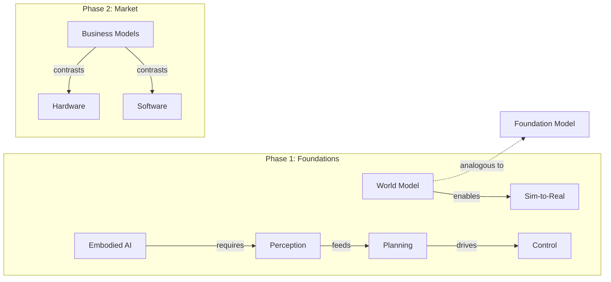

# Concept Linking & Relationship Tracking

## When to Trigger
- Deep Dive mode: ALWAYS (dedicated block, 10-15 min)
- Standard mode: NEVER (too time-constrained)
- Synthesis mode: review existing links as part of integration

## Concept Linking Flow

### Step 1: Surface Connections
After the lesson, present 3-5 connections between today's concepts and previous ones:

"Today we learned [CONCEPT A]. This connects to:
1. [PREVIOUS CONCEPT B] because [relationship]
2. [PREVIOUS CONCEPT C] because [relationship]
3. [PREVIOUS CONCEPT D] because [relationship]"

### Step 2: Learner Adds Links
Ask: "Can you spot any connections I missed? What else does [CONCEPT A] remind you of?"
- Accept and validate learner-generated links
- Add to the concept links table

### Step 3: Update Concept Links Table
In SESSION-STATE.md, maintain:

| Concept A | Relationship | Concept B | Session Added |
|-----------|-------------|-----------|---------------|
| World Model | enables | Sim-to-Real | 4 |
| VLA | combines | Perception + Planning + Control | 5 |
| Foundation Model | analogous to | LLM (in robotics context) | 3 |

### Relationship Types
- **enables**: A makes B possible or better
- **analogous to**: A is like B in a different domain
- **part of**: A is a component of B
- **contrasts with**: A and B are alternative approaches
- **builds on**: A is an evolution/extension of B
- **requires**: B cannot work without A

## Mermaid Concept Map Generation (E7)

### When to Generate/Update
- After every Deep Dive session with concept linking
- After every Synthesis session
- Save to: portfolio/concept-map.md

### Generation Rules
1. Read concept links table from SESSION-STATE.md
2. Group concepts by curriculum phase/week
3. Generate Mermaid graph:

4. Use solid arrows for strong relationships (enables, requires, part of)
5. Use dotted arrows for weak relationships (analogous to, contrasts with)
6. Color-code by mastery status: green=Known, yellow=Learning, red=New

### Size Management
- If >30 nodes: show only Known + Learning terms (hide New)
- If >50 nodes: show only current phase + direct connections to previous phases
